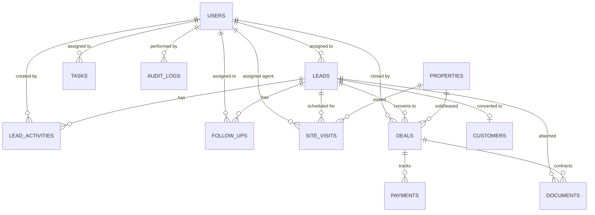

# Keystone Realty Advisor — Enterprise Real Estate CRM System Design (design.md)

---

## 1. Project Objective & Architecture

Build a production-ready, enterprise-grade Real Estate CRM system for **Keystone Realty Advisor** fully integrated into the existing project stack:

* **Backend:** Java 21 + Spring Boot 3 (Layered Architecture: Controller -> Service -> Repository -> Entity / DTO)
* **Frontend:** React 18 + Vite + Lucide React (Responsive, fast, clean SaaS UI)
* **Database:** MySQL 8.0 with relational integrity, foreign keys, and indexes
* **Authentication & Security:** JWT (JSON Web Tokens) + Granular Role-Based Access Control (RBAC) + BCrypt Hashing
* **Deployment:** Docker & Docker Compose orchestration
* **Design Philosophy:** 100% Real Database Data (Zero Fake/Demo Data, Zero Hardcoded Dashboard Stats)

### The Complete Business Lifecycle:
```text
Website Visitor / Ad Traffic
            ↓
  Public Lead Capture
            ↓
        NEW LEAD (Auto Deduplication & Assignment)
            ↓
        CONTACTED (Call / WhatsApp / Email logged)
            ↓
        QUALIFIED (Budget, Location & Need verified)
            ↓
  SITE VISIT SCHEDULED (Calendar & Property linked)
            ↓
  SITE VISIT COMPLETED (Feedback recorded)
            ↓
       NEGOTIATION (Price discussion & Proposal)
            ↓
      DEAL CREATED (Token / Advance Booking)
            ↓
    PAYMENT RECEIVED (Commission & Installments)
            ↓
    CONVERTED CUSTOMER (Post-sales & Documentation)
```

---

## 2. Core Architectural & Development Rules

### 🚫 Rule 1: No Demo / Fake Data in Production
* **Never** insert dummy leads, fake customers, fake deals, or fake agents into the database.
* Example names (e.g., *Rahul Sharma, Priya*) are solely for documentation illustrations.
* All dashboard stats, counters, charts, and tables must fetch directly from live MySQL queries.

### 🔒 Rule 2: Strict Security & Role-Based Access Control (RBAC)
* Agents can **only** access their assigned leads, tasks, and site visits.
* Managers can view team metrics, reassign leads, and review deals.
* Admins and Super Admins have full access to financial reports, user management, and system audit logs.

### ⚡ Rule 3: Server-Side Pagination & Filtering
* Large datasets (Leads, Properties, Audit Logs) must always use server-side pagination (`page=0&size=20`) and indexing to ensure instant response times.

---

## 3. User Roles & Permission Matrix

| Module / Action | SUPER_ADMIN | ADMIN | MANAGER | AGENT | ACCOUNTANT |
| :--- | :---: | :---: | :---: | :---: | :---: |
| **View All Leads** | ✅ | ✅ | ✅ (Team) | ❌ (Only Assigned) | ❌ |
| **Create / Edit Leads** | ✅ | ✅ | ✅ | ✅ (Assigned) | ❌ |
| **Assign / Reassign Leads** | ✅ | ✅ | ✅ | ❌ | ❌ |
| **Schedule Site Visits** | ✅ | ✅ | ✅ | ✅ | ❌ |
| **Create Deals & Tokens** | ✅ | ✅ | ✅ | ✅ | ✅ |
| **Manage Payments & Invoices** | ✅ | ✅ | ❌ | ❌ | ✅ |
| **User & Role Management** | ✅ | ✅ | ❌ | ❌ | ❌ |
| **Financial & Commission Reports** | ✅ | ✅ | ❌ | ❌ | ✅ |
| **System Audit Logs** | ✅ | ❌ | ❌ | ❌ | ❌ |

---

## 4. Complete CRM Database Schema (MySQL)



### Table 1: `users`
* `id` BIGINT AUTO_INCREMENT PRIMARY KEY
* `name` VARCHAR(100) NOT NULL
* `email` VARCHAR(150) NOT NULL UNIQUE
* `phone` VARCHAR(20) NOT NULL
* `password_hash` VARCHAR(255) NOT NULL
* `role` ENUM('SUPER_ADMIN', 'ADMIN', 'MANAGER', 'AGENT', 'ACCOUNTANT') NOT NULL
* `status` ENUM('ACTIVE', 'INACTIVE', 'SUSPENDED') DEFAULT 'ACTIVE'
* `last_login_at` DATETIME
* `created_at` DATETIME DEFAULT CURRENT_TIMESTAMP
* `updated_at` DATETIME ON UPDATE CURRENT_TIMESTAMP

### Table 2: `leads`
* `id` BIGINT AUTO_INCREMENT PRIMARY KEY
* `name` VARCHAR(100) NOT NULL
* `phone` VARCHAR(20) NOT NULL INDEX
* `email` VARCHAR(150) INDEX
* `source` ENUM('WEBSITE_CONTACT', 'PROPERTY_INQUIRY', 'PROJECT_INQUIRY', 'WHATSAPP_CLICK', 'DIRECT_CALL', 'FACEBOOK', 'GOOGLE', 'REFERRAL', 'MANUAL') NOT NULL
* `preferred_location` VARCHAR(255)
* `property_type` VARCHAR(50)
* `budget_min` DECIMAL(15,2)
* `budget_max` DECIMAL(15,2)
* `stage` ENUM('NEW_LEAD', 'CONTACTED', 'QUALIFIED', 'SITE_VISIT_SCHEDULED', 'SITE_VISIT_COMPLETED', 'NEGOTIATION', 'WON', 'LOST') DEFAULT 'NEW_LEAD' INDEX
* `priority` ENUM('LOW', 'MEDIUM', 'HIGH', 'URGENT') DEFAULT 'MEDIUM'
* `lost_reason` ENUM('BUDGET_ISSUE', 'LOCATION_ISSUE', 'NOT_INTERESTED', 'BOUGHT_ELSEWHERE', 'NO_RESPONSE', 'DUPLICATE', 'OTHER') NULL
* `lost_notes` TEXT NULL
* `property_id` BIGINT NULL (FK to properties if inquiry originated from a specific listing)
* `project_id` BIGINT NULL (FK to projects if inquiry originated from a project)
* `assigned_to_user_id` BIGINT NULL (FK to users) INDEX
* `last_contacted_at` DATETIME NULL
* `next_follow_up_at` DATETIME NULL INDEX
* `created_at` DATETIME DEFAULT CURRENT_TIMESTAMP INDEX
* `updated_at` DATETIME ON UPDATE CURRENT_TIMESTAMP

### Table 3: `lead_activities` (Timeline Log)
* `id` BIGINT AUTO_INCREMENT PRIMARY KEY
* `lead_id` BIGINT NOT NULL (FK to leads) INDEX
* `activity_type` ENUM('CALL', 'WHATSAPP', 'EMAIL', 'NOTE', 'STATUS_CHANGE', 'STAGE_CHANGE', 'PROPERTY_SHARED', 'SITE_VISIT', 'MEETING', 'SYSTEM') NOT NULL
* `note_text` TEXT NOT NULL
* `created_by_user_id` BIGINT NOT NULL (FK to users)
* `created_at` DATETIME DEFAULT CURRENT_TIMESTAMP

### Table 4: `follow_ups` (Reminders & Tasks)
* `id` BIGINT AUTO_INCREMENT PRIMARY KEY
* `lead_id` BIGINT NOT NULL (FK to leads) INDEX
* `assigned_to_user_id` BIGINT NOT NULL (FK to users) INDEX
* `scheduled_at` DATETIME NOT NULL INDEX
* `type` ENUM('CALL', 'WHATSAPP', 'EMAIL', 'MEETING', 'SITE_VISIT', 'DOCUMENT_COLLECTION') NOT NULL
* `priority` ENUM('LOW', 'MEDIUM', 'HIGH', 'URGENT') DEFAULT 'MEDIUM'
* `status` ENUM('PENDING', 'COMPLETED', 'MISSED', 'CANCELLED', 'RESCHEDULED') DEFAULT 'PENDING' INDEX
* `notes` TEXT NULL
* `completed_at` DATETIME NULL
* `created_at` DATETIME DEFAULT CURRENT_TIMESTAMP

### Table 5: `site_visits`
* `id` BIGINT AUTO_INCREMENT PRIMARY KEY
* `lead_id` BIGINT NOT NULL (FK to leads) INDEX
* `property_id` BIGINT NULL (FK to properties)
* `project_id` BIGINT NULL (FK to projects)
* `assigned_agent_id` BIGINT NOT NULL (FK to users)
* `visit_datetime` DATETIME NOT NULL INDEX
* `pickup_location` VARCHAR(255) NULL
* `status` ENUM('SCHEDULED', 'CONFIRMED', 'COMPLETED', 'CANCELLED', 'RESCHEDULED', 'NO_SHOW') DEFAULT 'SCHEDULED'
* `feedback_rating` INT NULL (1 to 5 stars)
* `feedback_notes` TEXT NULL
* `created_at` DATETIME DEFAULT CURRENT_TIMESTAMP

### Table 6: `deals`
* `id` BIGINT AUTO_INCREMENT PRIMARY KEY
* `lead_id` BIGINT NOT NULL (FK to leads) INDEX
* `customer_id` BIGINT NULL (FK to customers)
* `property_id` BIGINT NULL (FK to properties)
* `agent_id` BIGINT NOT NULL (FK to users)
* `deal_value` DECIMAL(15,2) NOT NULL
* `token_amount` DECIMAL(15,2) DEFAULT 0.00
* `commission_percentage` DECIMAL(5,2) DEFAULT 0.00
* `commission_amount` DECIMAL(15,2) DEFAULT 0.00
* `deal_stage` ENUM('NEGOTIATION', 'TOKEN_PENDING', 'TOKEN_RECEIVED', 'BOOKED', 'CLOSED', 'CANCELLED') DEFAULT 'NEGOTIATION'
* `payment_status` ENUM('PENDING', 'PARTIAL', 'PAID') DEFAULT 'PENDING'
* `expected_closing_date` DATE NULL
* `closed_at` DATETIME NULL
* `created_at` DATETIME DEFAULT CURRENT_TIMESTAMP

### Table 7: `payments`
* `id` BIGINT AUTO_INCREMENT PRIMARY KEY
* `deal_id` BIGINT NOT NULL (FK to deals) INDEX
* `amount` DECIMAL(15,2) NOT NULL
* `payment_type` ENUM('TOKEN', 'ADVANCE', 'INSTALLMENT', 'COMMISSION', 'FINAL_PAYMENT') NOT NULL
* `payment_method` ENUM('BANK_TRANSFER', 'UPI', 'CHEQUE', 'CASH', 'DEMAND_DRAFT') NOT NULL
* `transaction_reference` VARCHAR(100) NULL
* `payment_date` DATETIME NOT NULL
* `status` ENUM('SUCCESS', 'PENDING', 'FAILED', 'REFUNDED') DEFAULT 'SUCCESS'
* `receipt_url` VARCHAR(255) NULL
* `notes` TEXT NULL
* `created_by_user_id` BIGINT NOT NULL (FK to users)
* `created_at` DATETIME DEFAULT CURRENT_TIMESTAMP

### Table 8: `customers` (Post-Conversion Clients)
* `id` BIGINT AUTO_INCREMENT PRIMARY KEY
* `lead_id` BIGINT NOT NULL UNIQUE (FK to leads)
* `name` VARCHAR(100) NOT NULL
* `phone` VARCHAR(20) NOT NULL
* `email` VARCHAR(150) NULL
* `pan_number` VARCHAR(20) NULL
* `aadhaar_last_four` VARCHAR(4) NULL
* `current_address` TEXT NULL
* `permanent_address` TEXT NULL
* `created_at` DATETIME DEFAULT CURRENT_TIMESTAMP

### Table 9: `audit_logs`
* `id` BIGINT AUTO_INCREMENT PRIMARY KEY
* `user_id` BIGINT NULL (FK to users)
* `action` VARCHAR(50) NOT NULL (e.g. 'LEAD_STAGE_CHANGED', 'LEAD_REASSIGNED', 'DEAL_CREATED')
* `entity_type` VARCHAR(50) NOT NULL (e.g. 'LEAD', 'DEAL', 'PAYMENT')
* `entity_id` BIGINT NOT NULL
* `old_value` JSON NULL
* `new_value` JSON NULL
* `ip_address` VARCHAR(50) NULL
* `created_at` DATETIME DEFAULT CURRENT_TIMESTAMP INDEX

---

## 5. Automated Duplicate Lead Detection Engine

When an inquiry is submitted from website forms or external channels:

```text
Incoming Inquiry: (Name: "Rahul", Phone: "9911956274", PropId: 25)
                     ⬇
      Check MySQL: SELECT * FROM leads WHERE phone = '9911956274'
                     ⬇
    ┌────────────────┴────────────────┐
    │                                 │
[YES: Existing Lead Found]       [NO: New Lead]
    │                                 │
1. Do NOT create duplicate.       1. INSERT INTO leads (Stage: NEW_LEAD)
2. Update lead's updated_at       2. Auto-assign via Round-Robin
3. INSERT INTO lead_activities:   3. Trigger in-app notification to Agent
   "Client re-inquired for Prop   4. Return HTTP 201 Created
   #25: 3BHK Apartment"
4. If stage was LOST, reopen
   to CONTACTED.
```

---

## 6. Frontend UI Wireframes & Layout Specification

### 🖥️ Screen 1: Executive CRM Dashboard
* **Metrics Ribbon:** `Total Active Leads`, `New Inquiries (Today)`, `Follow-ups Due Today`, `Scheduled Site Visits`, `Pipeline Deal Value`, `Deals Closed (This Month)`.
* **Action Center (Today's Follow-ups):** Card list with 1-click `[ Call ]`, `[ WhatsApp ]`, `[ Reschedule ]`, `[ Complete ]`.
* **Lead Stage Funnel Chart:** Visual bar breakdown from `NEW_LEAD` to `CLOSED WON`.
* **Source Breakdown:** Chart showing inquiries by `Website`, `WhatsApp`, `Google`, `Direct Call`.

### 📋 Screen 2: Kanban Pipeline View
* Columns for each stage: `NEW LEAD` | `CONTACTED` | `QUALIFIED` | `SITE VISIT` | `NEGOTIATION` | `WON` | `LOST`.
* Visual cards displaying: Client Name, Phone, Budget Pill, Property Type, Next Action Time, Assigned Agent Avatar.
* HTML5 / Smooth Drag-and-Drop to move cards between columns.
* Dragging automatically triggers:
  1. API call `PUT /api/crm/leads/{id}/stage`
  2. Automatic Lead Activity Timeline record: *"Stage updated from CONTACTED to SITE_VISIT_SCHEDULED"*.
  3. Real-time Audit Log record.

### 🔍 Screen 3: Lead Detail Drawer / View
* **Left Column:** Client Contact info (1-click WhatsApp web link `https://wa.me/919911956274?text=...`, 1-click `tel:` link), Property interest, Budget slider/range, Lead Source, Assigned Agent selector, Stage dropdown.
* **Middle Column:** 
  * Quick Note & Follow-up Creator: Text area + Date/Time picker + Reminder type dropdown.
  * Activity Timeline: Reverse chronological feed of all calls, notes, site visits, and stage updates with timestamps and author names.
* **Right Column:** 
  * Site Visits Tab (Schedule, View status).
  * Deals & Token Tab (Create Deal, Record Advance).
  * Document Attachments Tab.

---

## 7. REST API Endpoints Specification

### 🔐 Authentication (`/api/auth`)
* `POST /api/auth/login` — Authenticate and return JWT token with user role & permissions.
* `GET  /api/auth/me` — Return current authenticated user profile.

### 📥 Public Lead Capture (`/api/crm/leads/public/capture`)
* `POST /api/crm/leads/public/capture` — Anti-spam protected, rate-limited public endpoint for website contact and property inquiry forms.

### 👤 Leads Management (`/api/crm/leads`)
* `GET    /api/crm/leads` — Paginated list with filters (`stage`, `source`, `agentId`, `priority`, `search`, `dateRange`).
* `GET    /api/crm/leads/{id}` — Full lead profile with activity timeline and linked property.
* `POST   /api/crm/leads` — Manual lead creation by agent/admin.
* `PUT    /api/crm/leads/{id}` — Update lead details.
* `PUT    /api/crm/leads/{id}/stage` — Update lead stage (generates activity & audit record).
* `PUT    /api/crm/leads/{id}/assign` — Reassign lead to another agent.
* `DELETE /api/crm/leads/{id}` — Soft delete / archive lead (Admin only).

### 📝 Activities & Follow-ups (`/api/crm/follow-ups` & `/activities`)
* `POST /api/crm/leads/{id}/activities` — Add call note, WhatsApp log, or meeting summary.
* `GET  /api/crm/follow-ups/today` — Retrieve all pending reminders scheduled for today.
* `GET  /api/crm/follow-ups/overdue` — Retrieve missed/overdue follow-ups.
* `PUT  /api/crm/follow-ups/{id}/complete` — Mark reminder as done.

### 🏡 Site Visits (`/api/crm/site-visits`)
* `GET  /api/crm/site-visits` — List scheduled visits (filterable by date/agent).
* `POST /api/crm/site-visits` — Schedule new property visit for a lead.
* `PUT  /api/crm/site-visits/{id}/status` — Update visit status (`COMPLETED`, `CANCELLED`, `NO_SHOW`) and record client feedback.

### 🤝 Deals & Payments (`/api/crm/deals` & `/payments`)
* `GET  /api/crm/deals` — List all active and closed deals.
* `POST /api/crm/deals` — Convert qualified lead into a booked deal.
* `POST /api/crm/payments` — Record token or commission payment.

### 📊 Dashboard & Reports (`/api/crm/dashboard`)
* `GET /api/crm/dashboard/stats` — Real-time live KPI counts.
* `GET /api/crm/dashboard/funnel` — Conversion funnel statistics.
* `GET /api/crm/dashboard/sources` — Lead distribution by acquisition channel.
* `GET /api/crm/dashboard/agent-performance` — Calls, visits, and deals closed per agent.

---

## 8. Step-by-Step Implementation Roadmap

```text
Phase 1: Backend Database & Entities (JPA entities, Repositories, Flyway/DDL migration)
Phase 2: Core CRM Backend Services & Controllers (LeadService, Deduplication, ActivityService, FollowUpService)
Phase 3: Public Capture API & Website Form Integration (Automatic lead creation on inquiry)
Phase 4: Frontend CRM Dashboard & Today's Follow-up Widget (Live database stats)
Phase 5: Frontend Kanban Pipeline Board & Drag-and-Drop (Visual stage transitions)
Phase 6: Frontend Lead Detail Drawer (1-Click WhatsApp, Call logs, Timeline)
Phase 7: Site Visit Management & Deal/Payment Tracking
Phase 8: End-to-End Testing, Security Audits & Production Docker Deployment
```
